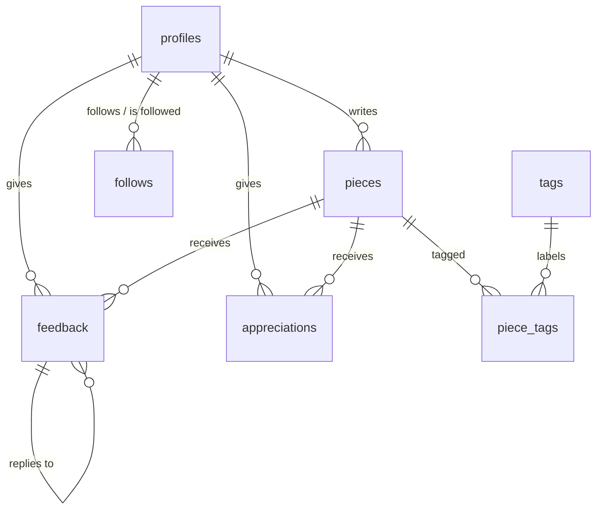

# Database Schema Design

Closes [#11](https://github.com/WriteMyWrongs/wmw-web/issues/11). The concrete DDL lives in
[`supabase/migrations/20260717000000_initial_schema.sql`](../supabase/migrations/20260717000000_initial_schema.sql);
this doc explains the shape and the reasoning.

## Context

WriteMyWrongs is a social app where young writers publish work, trade honest
feedback, and improve draft by draft. The landing page commits us to four
things the schema must support:

1. **A clean place to write** — a Tiptap editor with drafts and publishing.
2. **Feedback that helps** — line-by-line notes, not just top-level comments.
3. **Find your readers** — follows and appreciations.
4. **Grow with every draft** — progress over time (v2: challenges).

We're on Supabase, so the design leans on Postgres + Row Level Security, with
`auth.users` as the identity source.

## Entity overview

## Tables

### `profiles`

One row per user, keyed to `auth.users(id)`. Created automatically by a
trigger on signup so application code can assume a profile always exists.

| Column | Type | Notes |
| --- | --- | --- |
| `id` | `uuid` PK | FK → `auth.users(id)`, cascade delete |
| `username` | `text` | Unique (case-insensitive), `^[a-z0-9_]{3,24}$` |
| `display_name` | `text` | Falls back to username in the UI |
| `bio` | `text` | |
| `avatar_url` | `text` | |
| `created_at` / `updated_at` | `timestamptz` | `updated_at` maintained by trigger |

Our audience skews young, so we deliberately store **no PII beyond what auth
requires** — no birthdate, no location, no real-name field.

### `pieces`

A piece of writing. Drafts and published work live in one table distinguished
by `status`, so "publish" is an update, not a copy.

| Column | Type | Notes |
| --- | --- | --- |
| `id` | `uuid` PK | |
| `author_id` | `uuid` | FK → `profiles`, cascade delete |
| `title` | `text` | 1–200 chars |
| `content` | `jsonb` | The Tiptap/ProseMirror document |
| `content_text` | `text` | Plain-text extraction, maintained by the app on save |
| `status` | `piece_status` | `draft` \| `published` |
| `published_at` | `timestamptz` | Set on first publish |
| `search` | `tsvector` | Generated from `title` + `content_text`, GIN-indexed |
| `created_at` / `updated_at` | `timestamptz` | |

`content` is the editor's native JSON — no lossy HTML round-trips. The app
mirrors a plain-text copy into `content_text` on every save; a generated
`tsvector` column over title + text gives issue #28 (search) full-text search
with no extra infrastructure. Feed queries for #25 (dashboard) are served by
the `(status, published_at desc)` index.

### `tags` and `piece_tags`

Flat, freeform tags (`fantasy`, `poetry`, `short-story`) for issue #29
(filtering). Tags are global and created on first use; `piece_tags` is the
join table, capped at 5 tags per piece in the app layer.

### `feedback`

The heart of the product. One table covers both piece-level comments and
line-anchored notes:

| Column | Type | Notes |
| --- | --- | --- |
| `id` | `uuid` PK | |
| `piece_id` | `uuid` | FK → `pieces`, cascade delete |
| `author_id` | `uuid` | FK → `profiles`, cascade delete |
| `parent_id` | `uuid` | FK → `feedback`, for one-level reply threads |
| `body` | `text` | 1–5000 chars |
| `anchor` | `jsonb` | `null` for general comments; see below |
| `created_at` / `updated_at` | `timestamptz` | |

**Anchoring.** For line-by-line notes, `anchor` stores
`{ "from": int, "to": int, "quote": text }` — ProseMirror positions plus the
quoted text at the time of commenting. Positions can drift if the author
edits after publishing; the `quote` lets the UI re-locate the range (or
gracefully degrade to "on an earlier version") without a heavyweight
versioning system. Structured as `jsonb` rather than columns because the
anchor format will evolve with the editor and is opaque to SQL.

### `follows`

`(follower_id, followee_id)` composite PK, self-follow forbidden by check
constraint. Indexed on `followee_id` for "who follows me" and follower counts.

### `appreciations`

`(profile_id, piece_id)` composite PK — one appreciation per reader per
piece. Named deliberately: the product voice is "no red pen", so these are
appreciations, not likes.

## Row Level Security

RLS is enabled on every table; the service-role key bypasses it for admin
jobs.

Note that RLS is only half the story: current Supabase images grant the API
roles (`anon`, `authenticated`, `service_role`) **no DML on migration-created
tables** by default, so `20260717120000_grant_api_roles.sql` adds explicit
least-privilege grants (anon: read-only; authenticated: the DML the policies
allow; service_role: everything). Grants are the ceiling, policies pick the
rows. New tables in future migrations need their own grants.

Policy summary:

| Table | Read | Write |
| --- | --- | --- |
| `profiles` | everyone | owner (update only — insert is via trigger) |
| `pieces` | published: everyone; drafts: author only | author |
| `feedback` | visible iff its piece is visible | author of the feedback; only on **published** pieces |
| `tags` / `piece_tags` | everyone | any signed-in user / piece author |
| `follows` | everyone | the follower |
| `appreciations` | everyone | the appreciator; only on published pieces |

Two deliberate choices:

- **Feedback only on published pieces.** Drafts are private; there's nothing
  to critique until the writer chooses to share.
- **No public deletes/updates of others' content anywhere.** Moderation
  (reporting, hiding) is a v2 concern and will come with its own tables —
  it should not be improvised through RLS holes.

## Deferred to v2 (designed for, not built)

- **Challenges** (`challenges`, `challenge_entries`) — promised on the
  landing page but has no issue yet; the schema needs nothing changed to add
  it later.
- **Piece revisions** — full draft history. `pieces.updated_at` plus the
  anchor `quote` fallback is enough for MVP.
- **Notifications** — depends on product decisions in #26.
- **Moderation/reporting** — required before any real launch to minors;
  tracked separately.

## Downstream issues this unblocks

- #12 (connection): `supabase db push` / local `supabase start` consume the
  migration directly.
- #13 (models): generate TypeScript types with
  `supabase gen types typescript` against this schema.
- #25/#27/#28/#29: dashboard, creation flow, search, and filtering all have
  their storage and indexes in place.
